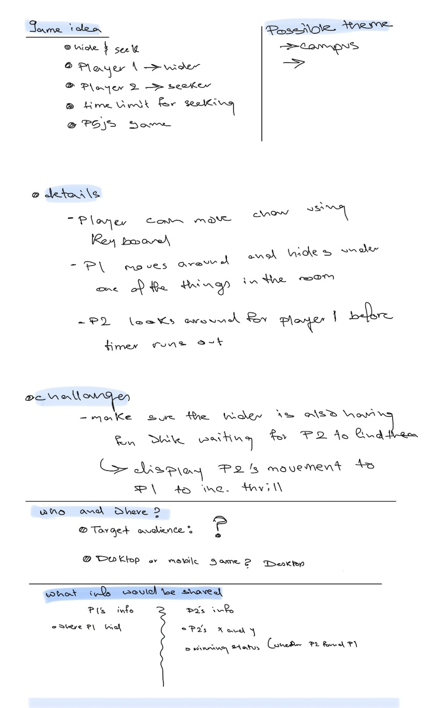
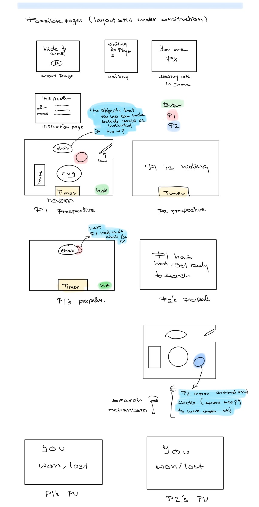
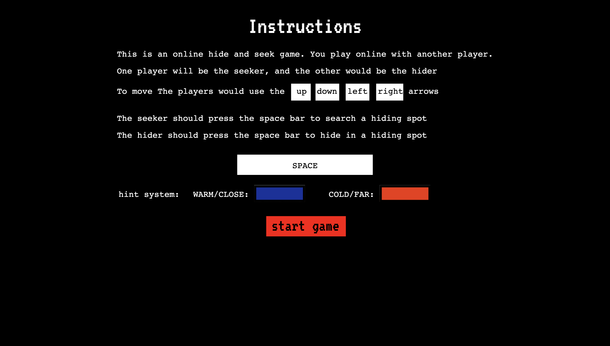
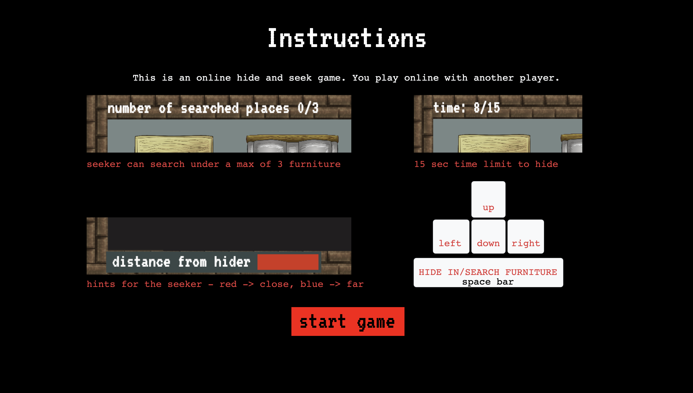
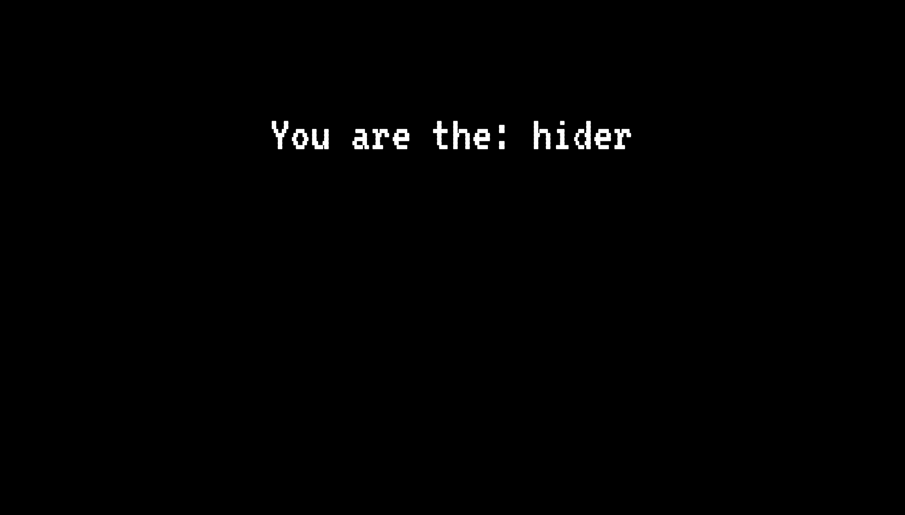
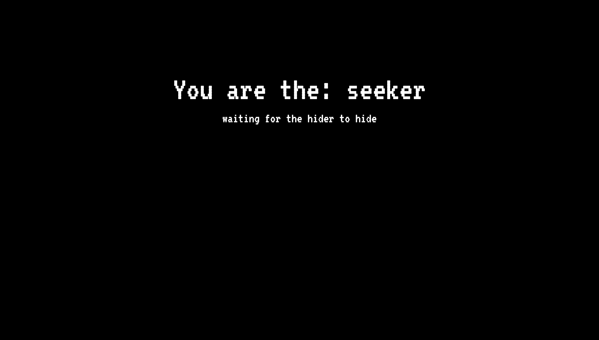
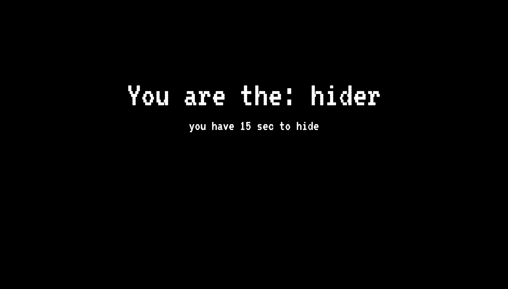
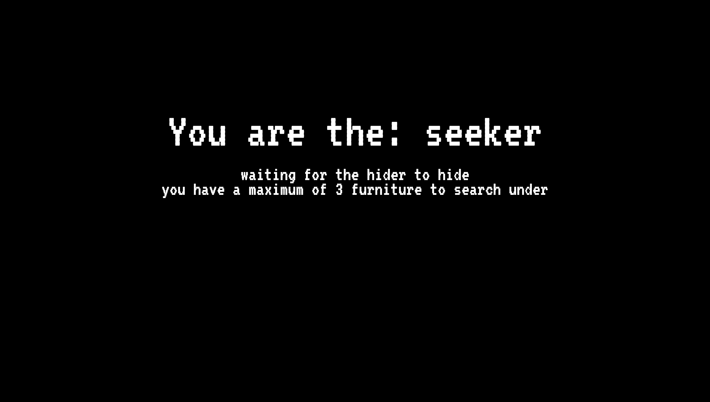
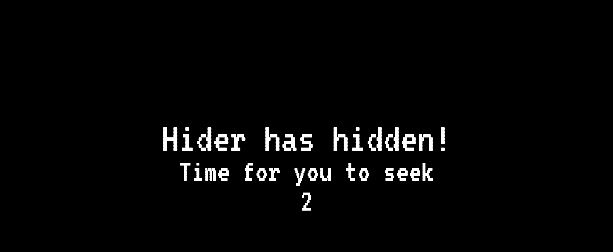
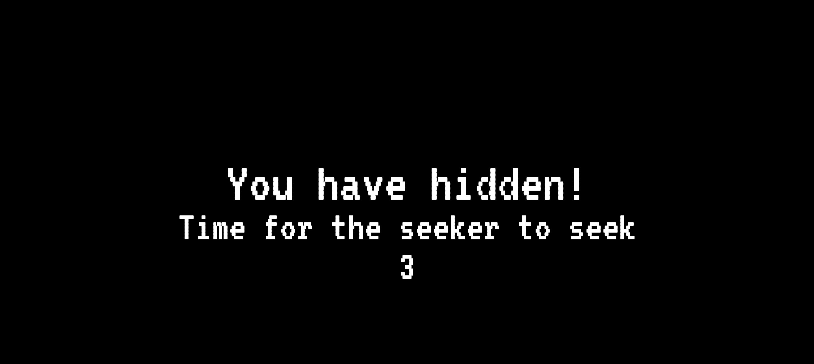

# Connections Lab Final Project
## [project Link](https://connections-lab---final-project.glitch.me/)
### ⚫️ The final project is a continuation of the second project. This version of the project takes into account much of the feedback received from friends and classmates and has been incorporated to produce a more enjoyable game
## production decisions (i.e. technical, design, conceptual, creative etc)
#### planning
we first noted down the details of our idea. We wanted to make sure we understand the target audience and the challenges that we must face. This would help us know what we would focus on and get a better idea of the design aspects. 
We also made sure to note down the overall steps, and made lists with bugs we encountered and any new steps that we thought were necessary after we started building the projecct.
This is an example of the inetial project idea notes. (we filled the gaps in our later meetings)

  

We then created the wireframes. This helped us visualize the project and the storyline and make sure that our visions align. Laying out the pages helped us when building the game becuase we have the pages and their order and the possible layout and needed elements for each page (buttons... etc) 

  

<!--  -->

#### front end (design)
We decided that the game was going to be a p5js game. Our first draft was one room with a player with basic functionality and elements (popups, movement, hiding...) 
[Initial one player room](https://editor.p5js.org/Nouf-Alabbasi/sketches/SaNU4HA9x) 
Once we tested that this works as intended, we moved on to create the seeker's version. using functions and classes made this steps a little easier. After testing we then moved on to creating the start, instruction and end pages. This was changed a little after testing but the main functionalities remained the same. We now had a game that has a hider and seeker views and the functionalities for both sides, however they are not connected yet. In the next section we talk about the backend, but as for the front end, after adding the sockets we expanded the eviroment to add more hiding places and rooms.

#### back end
We decided to use sockets as our main way of communicating between the two players. This was done because the current design of the game does not have data that needs to be stored long term hence the primary information does not need to be stored and retrieved from databses. Socket.io was used to implement sockets. This allowed for real-time communication between the two players. Game data was stored on the client entirely. Only movement and actions are sent over the server. This allows for very minimal transfer required and hence low latency for the game.

## influences and inspiration
We were inspired by retro games. This is why we used the audio and visuals that we used. We picked to recreate hide and seek as an online game becuase we haven't seen it done before. We thought it would be an intresting challenge to try to take a game that everyone knows and recreate the thrill you feel while playing it in real life. 

## challenges and solutions
delay
creating delay in the game was specifically a challenge because of the use of p5js to create the game. In p5, the draw function runs 60 (default) times every second, this makes it so that setTimeout and setInterval may not work as well. This was then solved by creating a delay using promises and async functions. The delay function is created here:
https://github.com/Nouf-Alabbasi/Connection_Lab_project_2/blob/bf89c1a59da6ba7d421746c4ce12049ac0a6bafc/public/app.js#L147
This stops all JavaScript code from continuing for the argument passed in milliseconds.

Maintaining the seeker's view
The seekers view to be displayed for the hider after he has hidden was also a challenging part to implement. This was because the view that was originally created also created the player object with the intention of being controlled by the client. This was then solved by creating a spectator attribute
https://github.com/Nouf-Alabbasi/Connection_Lab_project_2/blob/bf89c1a59da6ba7d421746c4ce12049ac0a6bafc/public/app.js#L756
inside the player class which is set to true if the view is the seekers view from the hider's perspective. If this attribute is true, the player can not be controlled by the client and the moving data is retrieved from the original seeker through sockets.
adding all the things that make the game intuitive to the user
  This is a very arbritrary challenge to overcome. As a developer it is much harder to think about how to develop the game for a user's intuition. Allowing our friends to play test the game is what truly helped in developing a sense of intuition from the users side. The small things that ended up making a big difference in creating good intuition were:
  1. text to show time/places remaning: 
  https://github.com/Nouf-Alabbasi/Connection_Lab_project_2/blob/bf89c1a59da6ba7d421746c4ce12049ac0a6bafc/public/app.js#L1051
  2. creating pop-ups to show if no one is hiding: 
  https://github.com/Nouf-Alabbasi/Connection_Lab_project_2/blob/bf89c1a59da6ba7d421746c4ce12049ac0a6bafc/public/app.js#L414
  3. adding appropriate sound effects: 
  https://github.com/Nouf-Alabbasi/Connection_Lab_project_2/blob/bf89c1a59da6ba7d421746c4ce12049ac0a6bafc/public/app.js#L415
  4. showing intermediate screens between turns: 
  This was done by including new states that the "state" variable could be set as. Then the same delay function introduced at
  https://github.com/Nouf-Alabbasi/Connection_Lab_project_2/blob/bf89c1a59da6ba7d421746c4ce12049ac0a6bafc/public/app.js#L147
  is used to maintain the intermediate screens for a few seconds before moving onto the next screen.
  https://github.com/Nouf-Alabbasi/Connection_Lab_project_2/blob/9eab9093e9a11d90c39e53ab7bebe275453e5dd6/public/app.js#L76
  5. restart mechanism: 
  The restart problem was solved by creating a button similar to the start button at the start of the game and using it to reload the webpage in the browser. The     command is a simple javascript function and the button is the Button class created for the start button.
  https://github.com/Nouf-Alabbasi/Connection_Lab_project_2/blob/9eab9093e9a11d90c39e53ab7bebe275453e5dd6/public/app.js#L85
  https://github.com/Nouf-Alabbasi/Connection_Lab_project_2/blob/9eab9093e9a11d90c39e53ab7bebe275453e5dd6/public/app.js#L23
  6. rooms:
  This category majorly includes the inclusion of rooms in our game. This allows multiple people to play this 2-player game by joining different rooms with their   friends. The implementation is made really simple throught he use of rooms already present in Socket.io. This category however also includes how smaller problems with connections are dealt with. For example disconnection of a user midgame should just allow the other player to restart the game. These design decisions and implementations is all bundled into the rooms implementation of the game.
  
  
## potential next steps
some of the potential next steps include:
* creating a 3d/VR version of the game can be very fun
* adding more players to the same game
* different map/level designs for each game
* making a mobile-friendly version

## relevant references/resources that were utilized
* for the sprites and imgs we used a few game sites that provided game assets.

## individual paragraphs
#### Hashim's paragraph
Creating this project was some of the most fun time spent time I have spent developing. The most interesting part for me was to recreate a an activity that is so common in real life in the digital world. This change from reality to the internet meant a lot of decisions to be made. This included how to properly show the information and what can make the game intuitive. Some decisions like showing the seeker view to the hider after he has hidden is something different real life but in my personal view this makes it more interesting. I was mostly supposed to handle the backend of the game. Through this project I could truly understand why sockets can be so efficent for real-time information transfer.

  ⚫️ Continuing the project for our final project was a very unique tasks. Much of the work that was now to be done was implementing feedback we had received from our classmates which was very different from implementing our ideas (like we had for project 2). This part of the development was also much more focused on fine-tuning the game further so everything flows naturally. This is much harder as a developer and so playtesting was a vital step towards thisreaching this final goal. 

#### Nouf's pragraph
I really enjoyed working on this project. It was really cool to finally see the project running online with players on different devices! In this project I wanted to focus on the pre project preperation in terms of ideation and creating the frameworks. So in our first few meetings we made sure to have a clear idea about the project in terms of basic idea, challanges, desgin elements and so on. We also made sure to keep track of the steps we have already gone through and the ones we still need finish. We also kept track of bugs and potential new ideas for things in the project. This was really helpful becuase we we're a team working on this project. I worked on the initial front end and wanted to try to keep the code clean, modular, and intuitive, I think that I did well on the later two goals, but feel like I could do better on the first. There are a few variables that we're used in a version of the code that we scratched that remain in the final version. I think for next time I'll make sure to delete all associated variables when deleting a code block which reduces the need to look for them later on when cleaning the code.

  
 ⚫️ for the final we wanted to improve our midterm project. improving the interface was alittle harder than I initially assumed. So much work had to go into predicting how the user would interact with our game's interfaces. It was also intresting to try and think of questions to ask our testers to gather as much feedback from the users about what isn't intuitive or could be improved and how they think it could be improved. We also spent alot of time thinking of the placement of all the elements of the page. This was really enjoyable and an intresting challenge!

## ⚫️ Features added since the last version:
* Adding hints (hot and cold)
* Adding a restart mechanism
* Adding more players
* adding rooms (sockets)
* fixing bugs

## ⚫️ User experience 
for the current version of the Hide and Seek we wanted to improve the user experience to make the game as intuitive as possible. After user testing a few times and gathering the tester's feedback and make a list of possible improvments to the game.
#### User interface
* The instruction page line is unaligned (left right and so on)
* On the role page let the user know that they have 3 searches, and 10 secs to hide
* The timer should go down not up
* Let the users know that they need to refresh to restart a game or add a restart button
* Hint placement unclear(check instructions)
* Time and hint placement unnoticed
  *  add a note about them in the instrictions
  *  remind the users of their limited time and number of searches in the role page before the game starts
* Shorten the instructions

#### Tech
* White hint bar when user doesn’t hide
* Make hider lose when they don’t choose
* Add screen to tell the hider that they hid
* More time for the hider to hide
* If user leaves, game shouldn’t end
* The red doesn’t change quickly

#### Minor
* The hints in the instruction page look clickable 

#### Extra features
* The hints appear only if you ask for them(based on level)
* let the seeker know where the hider hid if the seeker fails to find the hider.

we decided the ones that we would tackle which included:
* Adjust timer (so it counts down instead of counts up -> 10,9,8...ect instead of 1,2,3...ext)
* add refresh button at the end page
* shorten the instructions
* add the "you have 15 sec to hide" or "you can search under a max of 3 furniture" text in the role page.
* fix hint system bug/ end game if user didn’t hide
* add screen to tell hider and seeker that the hider has hid

### here are some of the chnages:
### instructions page:

  

changes: 

* we realized that people are likely to be already familiar with using the keybaord arrows to move around, so we reduced the instructions that explain that to make space for instructions about things the users are less familiar with or are unique to this game
* we noticed that the hint instructions in the current version don't really indicate where they could be on the screen so we used screenshots of the hint/timer and search limit text on the screen and placed them in a position that could indicate their placement on the game screen
* We also clarified the hint, timer and limited searches in the instructions page briefly.
* We made sure that all the instructions are brief and can be understood as best as possible by a user who only scan this page

  

### role page:

  

  

changes: 

* we added a short note on the time limit and maximum for users who skip over the insturctions page as those things are essential to the game 

  

  

### hider hidden page:

  

  

## ⚫️ future ideas:
* Implement the game in a VR environment
* Implement different hint systems/ allow different hints for different skill levels
* Continue user testing to make the game even more intuitive
